```{r setup, include=FALSE}
options(htmltools.dir.version = FALSE)
knitr::opts_chunk$set(
  fig.width=9, fig.height=3.5, fig.retina=3,
  out.width = "100%",
  cache = FALSE,
  echo = TRUE,
  message = FALSE, 
  warning = FALSE,
  hiline = TRUE
)
```

```{r xaringan-themer, include=FALSE, warning=FALSE}
library(xaringanthemer)
style_duo_accent(
  primary_color = "#1381B0",
  secondary_color = "#FF961C",
  inverse_header_color = "#FFFFFF"
)
```

class: inverse, center, title-slide, middle
background-image: url('./Platynereis_connectome_files/figure-html/Naomi-connectome-slide-bg.png')
background-size: cover

<style>
.title-slide .remark-slide-number {
  display: none;
}
</style>

# The _Platynereis_ connectome

### Sanja Jasek

### 30.5.2022

---

## VolumeEM dataset of the three-day-old _Platynereis_

.pull-left[

]

.pull-right[
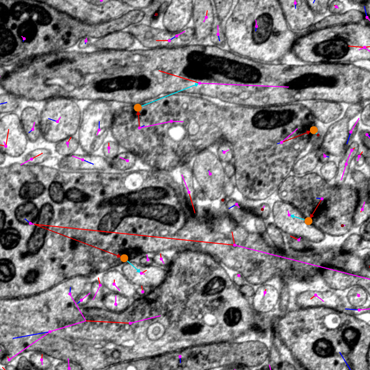
]

---

## all neurons

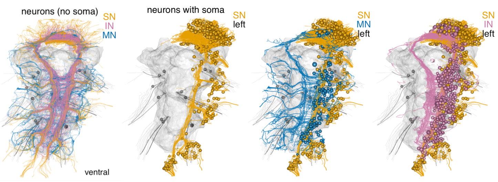
---

## all synapses

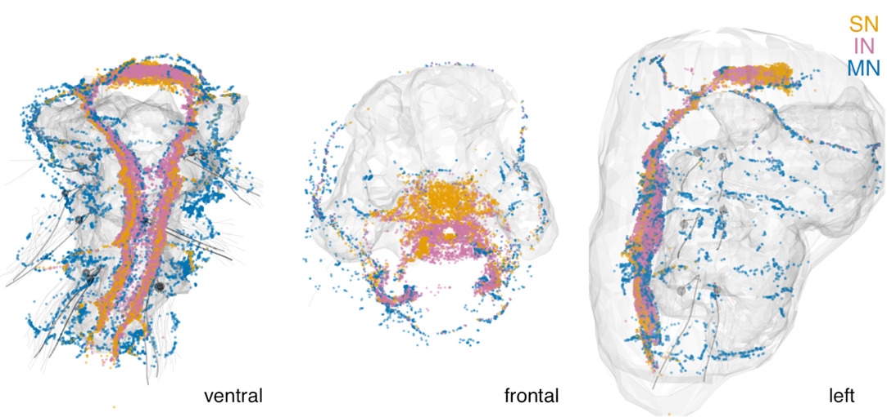
---

## effectors and full cell complement

.center[
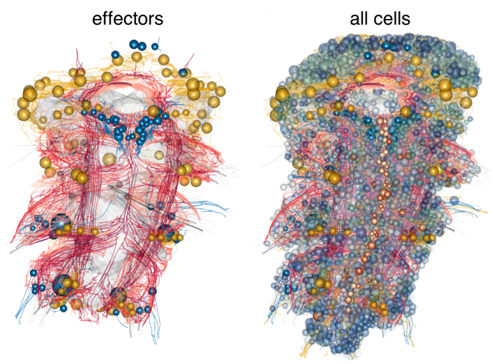
]


---

background-image: url('./Platynereis_connectome_files/figure-html/synaptic-connectome-modules.png')
background-size: contain

## full connectome

---

## sensory neurons

.center[
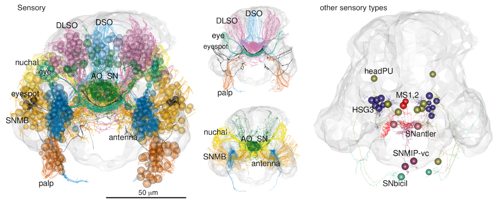
]

---

## mushroom body

.center[
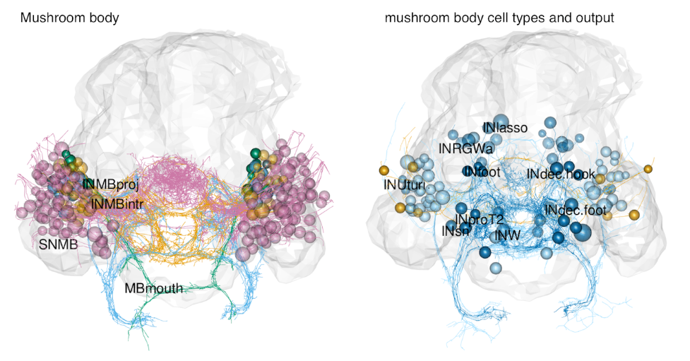
]

---

## connectivity of mature MB neurons

.center[
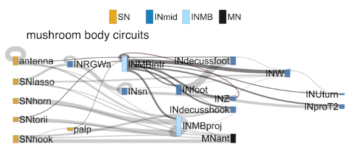
]

---

## interneurons

.center[
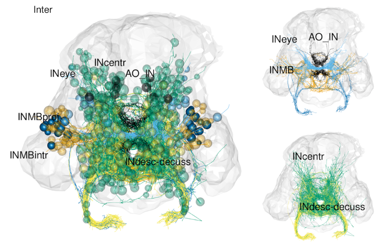
]

---

## motor neurons

.center[
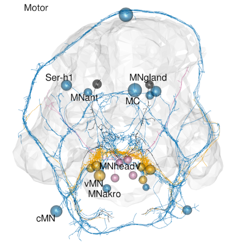
]
 
---

## motor neurons

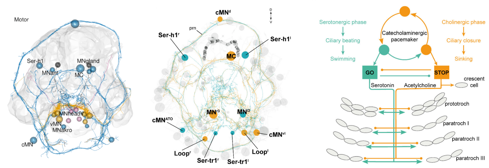
---

## antler circuit

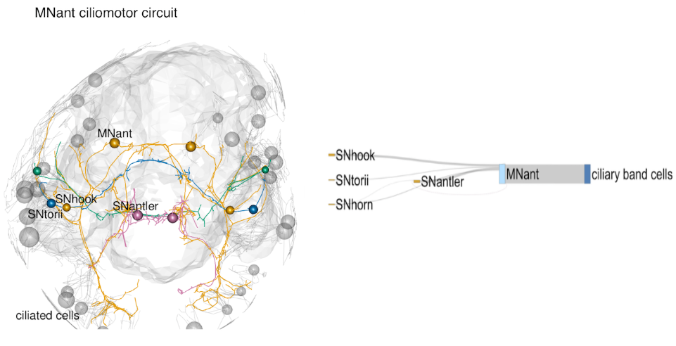

---

## postural control circuit

.center[
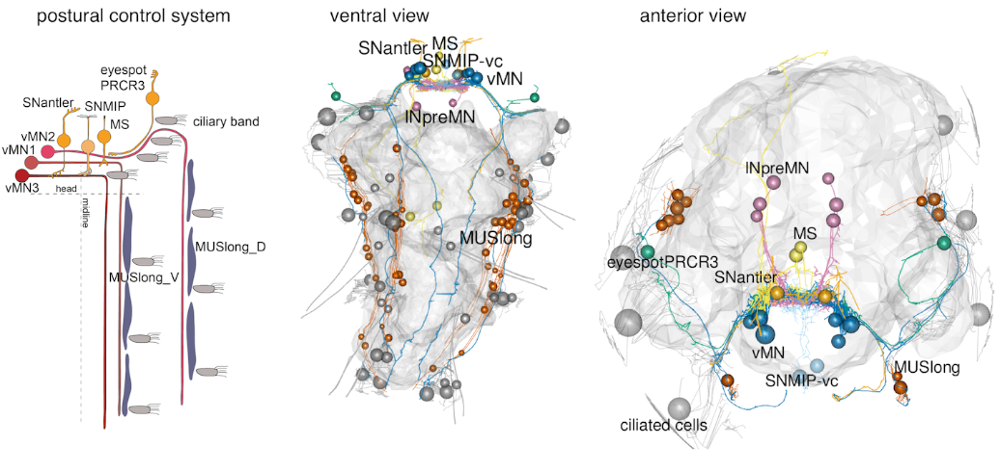
]

---

## eye circuit

.center[
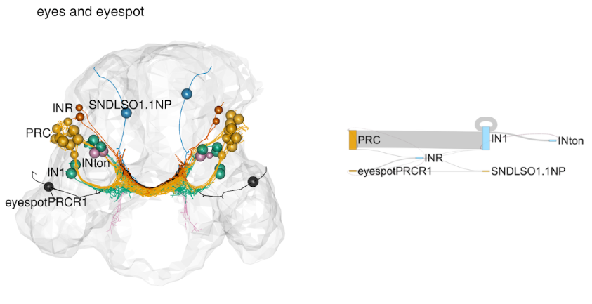
]

---

## connectivity between head regions

.center[
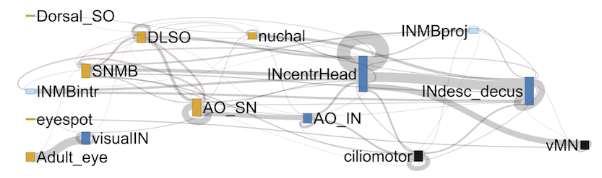
]

---

## acknowledgements

.pull-left[
### analysis
- Gáspár Jékely
- Csaba Verasztó
- Sanja Jasek
]

.pull-right[
### tracing and annotations
- Csaba Verasztó
- Gáspár Jékely
- Sanja Jasek
- Martin Gühmann
- Réza Shahidi
- Nobuo Ueda
- James David Beard
- Sara Mendes
- Konrad Heinz
- Luis Alberto Bezares-Calderón
- Elizabeth Williams
]
